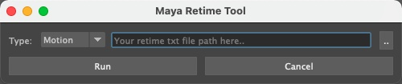

# MayaCameraRetime
1.Download the entire package

2.Put it in the 'modules' folder

Put the "MayaCameraRetime.mod" file in the same directory

`C:\Users\<username>\My Documents\Maya\modules`


3.Run python code in Maya：
```Python
import MayaCameraRetime
reload(MayaCameraRetime)
MayaCameraRetime.main()
```

4.Now you can see the tool



5.Select the retime txt file and run it.
