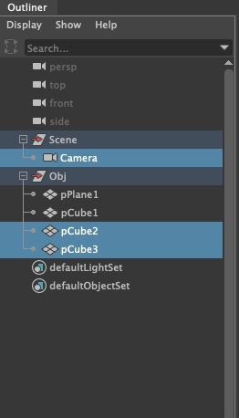

# MayaCameraRetime
1.Download the entire package and put it in the script folder of Maya.  

2.Run python code in Maya：
```Python
import MayaCameraRetime
reload(MayaCameraRetime)
MayaCameraRetime.main()
```

3.Now you can see the tool


4.Select all the animated objects and click the Run button.

